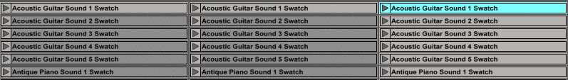

# HEM Sound Library

HEM Sound Library is an open-source collection of sound samples and generative music tools for Ableton Live.

This Sound Library contains 30 sample packs containing over 1800 samples of traditional instruments, extended technique, microtonality, spectralism, non-cochlear events, conceptual sound, studio outtakes, noise reduction artefacts, no-input mixer, rare synth units, secondhand-store vinyl, etc., plus a generative sample playback engine called "Seurat MIDI".

# The Demonstration Disc

The "Demonstration Disc" is the best way to see what the library is fully capable of. It is also the first full–length album made with the Sound Library.

OUT ON OCTOBER 6th, 2017

# Tutorials

## 1) MIDI Pointilism: Seurat MIDI

https://www.youtube.com/watch?v=ms2w2-nbIvU

## 2) Generative Poetry (Sampling and Troubleshooting Seurat MIDI)

https://www.youtube.com/watch?v=-2YR1MlJiEY

# History

HEM SL was recorded and developed by Jason Grier between 2013 and 2017. It has been the  mainstay of his live performances since 2013, and is now available for public use.

# Credits

Cover art: Abstract Painting (726) © Gerhard Richter 2017

All tracks and applications © Jason Grier 2014–2017

Made with HEM SL and Seurat MIDI

with: Julia Holter, Lucrecia Dalt, Jana Papenbroock, Corey Fogel, Danny Meyer, Hogir Göregen, Alain Paul, Laena Myers-Ionita, Annelyse Gelman
