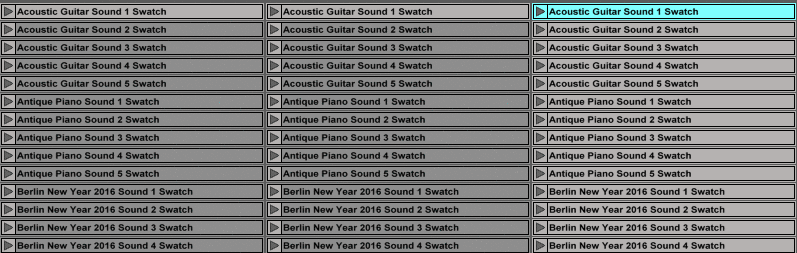

# HEM Sound Library

HEM Sound Library is an open-source collection of sound samples and generative music tools for Ableton Live.

This Sound Library contains 30 sample packs containing over 1800 samples of traditional instruments, extended technique, microtonality, spectralism, non-cochlear events, conceptual sound, studio outtakes, noise reduction artefacts, no-input mixer, rare synth units, secondhand-store vinyl, etc., plus a generative sample playback engine called "Seurat MIDI".

You can browse and hear actual presets at [HEM](https://hem.rocks/sl), or by playing the mp3 samples directly from this repository, under "Sounds". Find something you like, download the `.alp` file, and start working immediately in Ableton Live. Follow the tutorials to more about using the library in your own work. To contribute to the library, see below.

# THE DEMONSTRATION DISC – OUT 6. OCTOBER, 2017

The "Demonstration Disc" is the best way to see what the library is fully capable of. It is also the first full–length album made with the Sound Library. Starting on 6th of October, you can get it here in its entirety by checking the Ableton project files out of Github.

\*_Also available on iTunes, Spotify and limited-edition vinyl._

Sign up to be notified here: http://hem.rocks/

# Tutorials

## 1) MIDI Pointilism: Seurat MIDI

Seurat is a general-purpose tool to explore large numbers of samples, and to create textures out of them. It does this by "spraying" MIDI notes around on your sample set.  This is likened to how Georges Seurat painted with dots. Try tutorial #2 "MIDI Pointilism" to see how Seurat works. (Seurat MIDI does not require Max for Live.)

## 2) Follow-action Wind Chime

Once you've found a bunch of presets for Seurat, render them out as clips. Then use random follow actions to find complex ideas for compositions.

## 3) Live Rig

Gather all your Seurat presets together and consolidate, then drop them from the browser onto a track, and tweak their settings at will. One cool live performance trick is to have a few Seurat instances with throttle set to almost zero, leading to huge gaps of silence and rare alternating accents for your main part(s).

## 4) Capture and Edit

Complete a finished track by capturing the MIDI output of Seurat and perfecting the device's performance.

# History

HEM SL was recorded and developed by Jason Grier between 2013 and 2017. It has been the  mainstay of his live performances since 2013, and is now available for public use.

<iframe width="100%" height="450" scrolling="no" frameborder="no" src="https://w.soundcloud.com/player/?url=https%3A//api.soundcloud.com/tracks/336965418%3Fsecret_token%3Ds-gfBna&amp;auto_play=false&amp;hide_related=false&amp;show_comments=true&amp;show_user=true&amp;show_reposts=false&amp;visual=true"></iframe>

Jason Grier performing with HEM SL and Seurat live at Studio Acht, Berlin, July 23rd 2017:

# Credits

Cover art: Abstract Painting (726) © Gerhard Richter 2017
All tracks and applications © Jason Grier 2014–2017
Made with HEM SL and Seurat MIDI (BSD free software license, on included on DVD)

with: Julia Holter, Lucrecia Dalt, Jana Papenbroock, Corey Fogel, Danny Meyer, Hogir Göregen, Alain Paul, Laena Myers-Ionita, Annelyse Gelman

# Contributing
